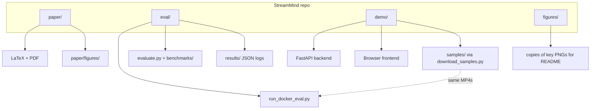
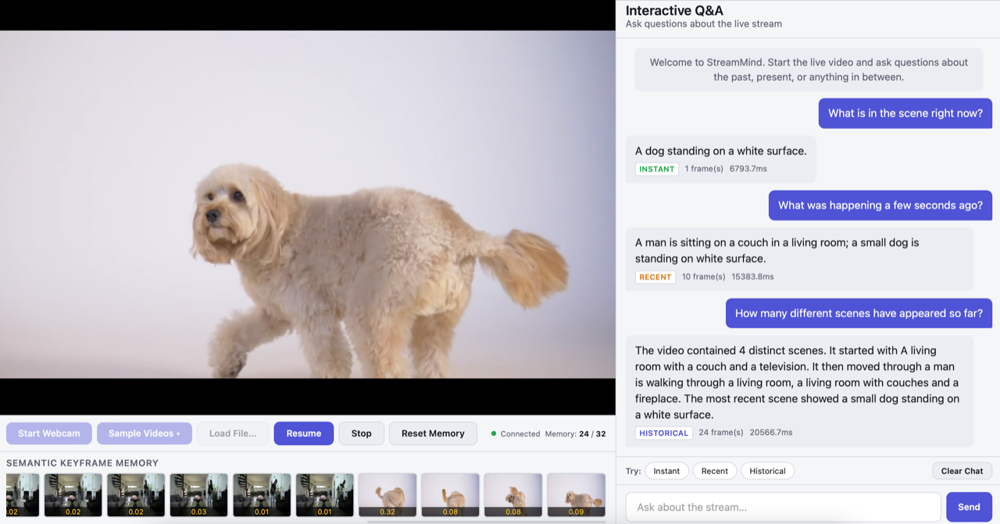
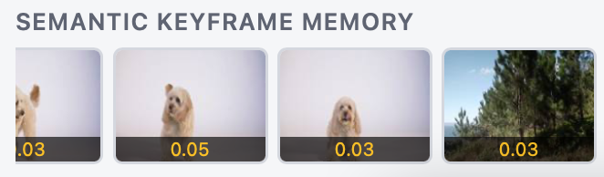
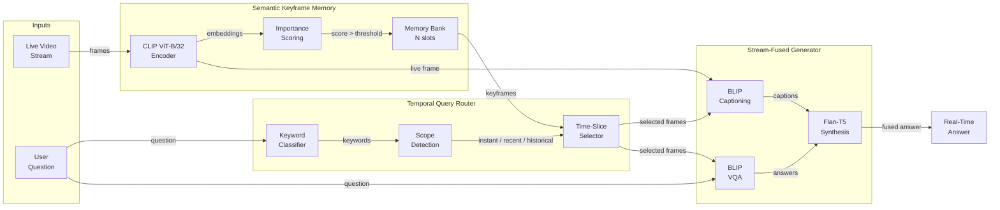
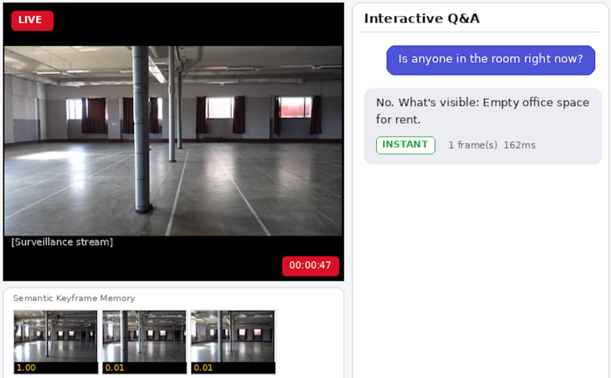
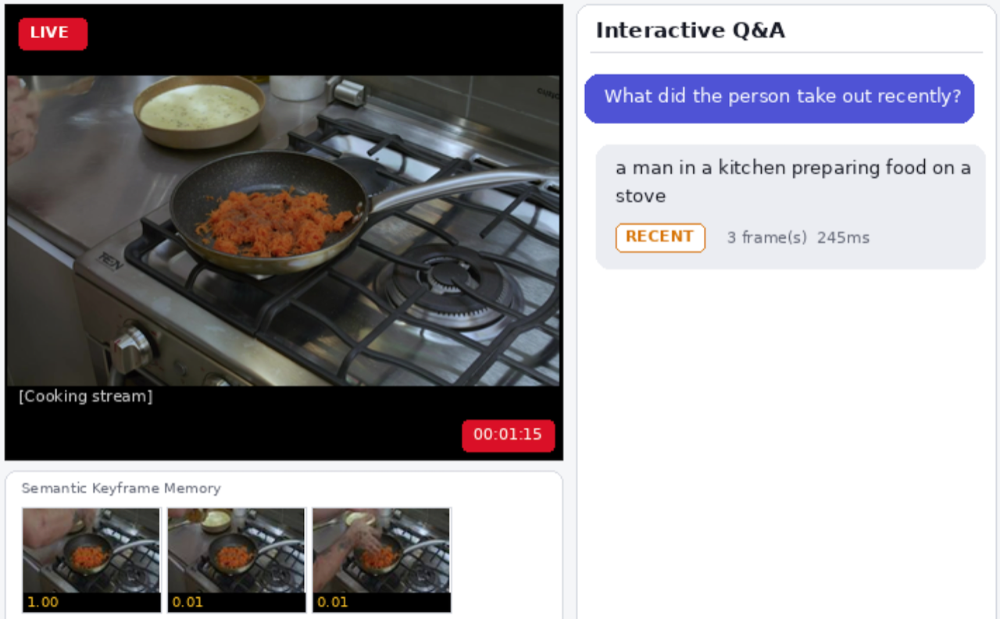
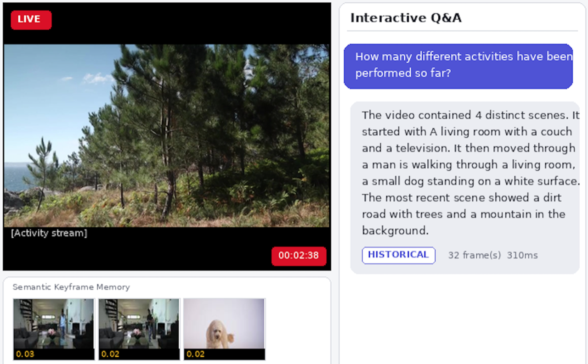

# StreamMind

**Adaptive Temporal Memory for Interactive Question Answering on Live Video Streams**

**CVPR 2026 Workshop on Vision-and-Language Reasoning (VAR)**

Suresh Kumar Palus, Partha Sarathi Samal, Sai Kiran Padmam, Bhavan Kumar B.R

StreamMind is a streaming vision-language system for interactive Q&A on live video. Most VideoQA models need the full recording before they can answer anything. StreamMind works on video that is still playing. You can ask about the present, the last few seconds, or earlier in the stream.

## Repository layout



## Live demo

<p align="center">
  
</p>

## SKM filmstrip (memory view)

<p align="center">
  
</p>

## Key ideas

- **Semantic Keyframe Memory (SKM)** keeps a fixed bank of N frames scored by visual novelty and spread in time. Important moments stay; redundant ones are replaced.
- **Temporal Query Router (TQR)** decides if a question is instant, recent, or historical and passes only the matching slice so past and present do not get mixed up.
- **Stream-Fused Generator (SFG)** uses BLIP on selected frames, then Flan-T5 to merge captions and VQA bits into one answer.
- **LiveQA-Bench** uses 55 diverse streams with per-question scope labels and a strict causal viewing rule.

## Architecture



## Qualitative results

### Instant scope - "What is happening right now?"

<p align="center">
  
</p>

### Recent scope - "What just happened?"

<p align="center">
  
</p>

### Historical scope - "What has happened throughout the stream?"

<p align="center">
  
</p>

## Results (paper table, LiveQA-Bench)

Reference baselines use the same causal rule: only frames up to the question time count.

| Method | Instant | Recent | Hist. | Overall |
|--------|--------:|-------:|------:|--------:|
| Video-ChatGPT | 40.7 | 5.6 | 11.1 | 22.2 |
| VideoLLaVA | 44.4 | 5.6 | 16.7 | 25.4 |
| SeViLA | 48.1 | 11.1 | 16.7 | 28.6 |
| Chat-UniVi | 44.4 | 5.6 | 11.1 | 23.8 |
| LLaVA-Next-Video | 51.9 | 11.1 | 22.2 | 31.7 |
| LLaVA-NV + Buffer | 55.6 | 11.1 | 22.2 | 33.3 |
| Flash-VStream | 48.1 | 16.7 | 16.7 | 30.2 |
| VideoLLM-online | 51.9 | 16.7 | 27.8 | 34.9 |
| Dispider | 51.9 | 22.2 | 27.8 | 36.5 |
| **StreamMind** | **45.0** | **37.4** | **73.5** | **51.7** |

StreamMind reaches **51.7%** overall at **~242 ms** mean latency on an A100 in our run, about **15 points** above the strongest baseline in this table (Dispider 36.5%).

### Ablations (same A100 run, 2652 questions)

| Configuration | Instant | Recent | Hist. | Overall | Mean latency |
|---------------|--------:|-------:|------:|--------:|-------------:|
| Full (N=64) | 45.0 | 37.4 | 73.5 | 51.7 | 242 ms |
| FIFO instead of SKM | 44.3 | 36.3 | 73.2 | 51.0 | 242 ms |
| No TQR | 30.0 | 46.9 | 74.3 | 48.0 | 170 ms |
| N = 16 | 46.8 | 39.6 | 76.8 | 54.1 | 245 ms |
| N = 32 | 44.1 | 35.6 | 72.2 | 50.5 | 244 ms |
| N = 128 | 45.0 | 37.4 | 73.3 | 51.7 | 243 ms |

### Latency breakdown (A100, FP16, profiling table from paper)

| Component | Mean (ms) |
|-----------|----------:|
| CLIP encoding (per frame) | 20 |
| SKM scoring + update | <1 |
| TQR scope classification | <1 |
| BLIP captioning (per frame) | 248 |
| BLIP VQA (per frame) | 114 |
| Flan-T5 synthesis | 75 |
| **Total per query (profiled)** | **203** |

### Where these numbers are saved

After you run the eval notebook or `eval/run_docker_eval.py`, JSON logs land under `eval/results/`. On our side we often keep a snapshot folder such as `eval/results/streammind_A100_gpu_results_52/` containing:

- `liveqa_full.json` — per-question rows plus a top-level `summary` (accuracy, latency, scope counts)
- `ablation_summary.json` — `full`, `fifo`, `no_tqr`, and `N16` / `N32` / `N128` blocks

Commit those files if you want the links above to resolve on GitHub; otherwise run the eval once and inspect the same paths locally.

## Modules (quick map)

| Area | Role |
|------|------|
| `demo/backend/app.py` | FastAPI app and WebSocket routes |
| `demo/backend/stream_processor.py` | Frames in, CLIP features, handoff to SKM |
| `demo/backend/memory_manager.py` | SKM retention and scoring |
| `demo/backend/vlm_engine.py` | TQR + BLIP + Flan-T5 answer path |
| `eval/run_docker_eval.py` | Builds LiveQA from samples and runs full scoring |
| `eval/evaluate.py` | Generic benchmark driver (NExT-QA, EgoSchema, …) |
| `eval/pipeline.py` | Shared eval pipeline pieces |
| `eval/benchmarks/` | Per-dataset loaders |

## Paper, eval, demo

- **Paper:** `latexmk -pdf main.tex` in `paper/`. Details in [`paper/README.md`](paper/README.md).
- **Evaluation:** [`eval/README.md`](eval/README.md) and `eval/StreamMind_Eval.ipynb`.
- **Demo:** [`demo/README.md`](demo/README.md).

**Eval quick start:**

```bash
cd eval
pip install -r requirements.txt
python run_docker_eval.py --project-root ..
```

**Demo quick start:**

```bash
cd demo
docker compose up --build -d
```

Then open `http://localhost:8000`. Sample MP4s: `python demo/scripts/download_samples.py --eval` from repo root (videos stay gitignored as `*.mp4`).

## Models used

Frozen Hugging Face checkpoints only.

| Component | Model |
|-----------|-------|
| Frame encoder | `openai/clip-vit-base-patch32` |
| Captioning | `Salesforce/blip-image-captioning-base` |
| VQA | `Salesforce/blip-vqa-base` |
| Language | `google/flan-t5-base` |

## Citation

```bibtex
@inproceedings{palus2026streammind,
  title     = {StreamMind: Adaptive Temporal Memory for Interactive
               Question Answering on Live Video Streams},
  author    = {Palus, Suresh Kumar and Samal, Partha Sarathi
               and Padmam, Sai Kiran and B.R, Bhavan Kumar},
  booktitle = {Proceedings of the IEEE/CVF Conference on Computer
               Vision and Pattern Recognition (CVPR) Workshops},
  year      = {2026}
}
```

## License

See per-component licenses. The CVPR LaTeX kit follows the [author kit](https://github.com/cvpr-org/author-kit) terms.
