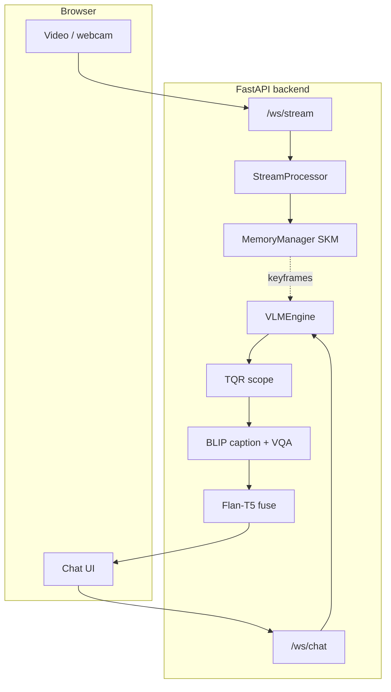

# StreamMind Demo

Browser demo for **StreamMind**: live or uploaded video, Semantic Keyframe Memory (SKM) filmstrip, and chat answers with temporal scope labels.

## What you see

- **Left:** video (webcam, upload, or samples) and the SKM strip of retained keyframes.
- **Right:** questions and answers. Each reply notes whether the question was treated as instant, recent, or historical.

## How requests flow



## Quick start

### Dependencies

```bash
cd demo/backend
pip install -r requirements.txt
```

**CPU demo:** FastAPI stack runs without a GPU; answers use the same BLIP + Flan-T5 path when PyTorch and `transformers` are installed.

**GPU:** Install PyTorch with CUDA for faster CLIP encoding and model inference.

### Run the server

```bash
cd demo/backend
python app.py
```

Optional: `MEMORY_CAPACITY=64` to change SKM size (default 32). Open `http://localhost:8000`.

### Sample videos

```bash
cd demo/scripts
python download_samples.py          # demo clips
python download_samples.py --eval   # LiveQA-style eval clips (many files)
```

The activity composite needs `ffmpeg` on your PATH.

### Docker

```bash
cd demo
docker compose up --build -d
```

Then open `http://localhost:8000`. Videos are fetched during the image build when configured in the Dockerfile.

## Workshop mode

Use **Presentation Mode** in the header for larger type, suggested one-click questions across all three scopes, and clear scope and latency hints for an audience.

## Example questions

| Question | Typical scope |
|----------|---------------|
| What do you see right now? | Instant |
| What did I just pick up? | Recent |
| Was there a red object earlier? | Historical |
| How many different scenes so far? | Historical |

## Configuration

| Variable | Default | Role |
|----------|---------|------|
| `MEMORY_CAPACITY` | 32 | SKM slot count |

Models are fixed in `vlm_engine.py` (CLIP for encoding in `stream_processor.py`, BLIP + Flan-T5 for answers).

## Scripts

| Script | Role |
|--------|------|
| `scripts/download_samples.py` | Pull Mixkit samples into `frontend/samples/` |
| `scripts/generate_paper_figures.py` | Build qualitative PNGs for the paper from samples |
| `scripts/generate_figures.py` | Legacy matplotlib placeholders (prefer `generate_paper_figures.py`) |

## Layout

```
demo/
  backend/
    app.py                 FastAPI + WebSockets
    stream_processor.py    Frames into CLIP / SKM
    memory_manager.py      SKM retention
    vlm_engine.py          TQR + BLIP + Flan-T5
    requirements.txt
  frontend/
    index.html  style.css  app.js
    samples/               Downloaded MP4s (gitignored at repo root via *.mp4)
  scripts/
    download_samples.py
    generate_paper_figures.py
    generate_figures.py
```

## Requirements

- Python 3.10+
- A current browser with WebSocket support
- `ffmpeg` for the multi-scene activity sample
- Optional: NVIDIA GPU + CUDA for comfortable latency
