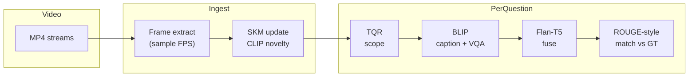

# StreamMind Evaluation

Runs the same stack as the paper under a **causal protocol**: at question time `t_q`, only frames in `[0, t_q]` are visible.

## Pipeline (high level)



## Setup

```bash
cd eval
pip install -r requirements.txt
```

Models download from Hugging Face on first use. Prefer a GPU with at least 16 GB VRAM (A100, 3090 class). CPU works but is slow.

## LiveQA-Bench (in this repo)

LiveQA is generated from the same sample videos as the demo:

1. Download clips: from repo root, `python demo/scripts/download_samples.py --eval` (writes under `demo/frontend/samples/`).
2. Run the harness: `python run_docker_eval.py` from `eval/` (or use `StreamMind_Eval.ipynb` on Colab). It scans `demo/frontend/samples/*.mp4`, builds questions, scores answers, and writes JSON under `eval/results/` (exact folder name depends on your run).

Canonical numbers for the paper were produced on an **A100**; committed snapshots may live under paths such as `eval/results/streammind_A100_gpu_results_52/`:

| File | Contents |
|------|----------|
| `liveqa_full.json` | Per-question rows + `summary` (accuracy, latency, scope breakdown) |
| `ablation_summary.json` | `full`, `fifo`, `no_tqr`, and memory sizes `N16` / `N32` / `N128` |
| `latency.json` | Per-component timing from profiling |

Example `summary` from one A100 run (2652 questions, SKM N=64): overall **51.7%**, instant **45.0%**, recent **37.4%**, historical **73.5%**, mean latency **~242 ms**.

## Other benchmarks (bring your own video)

Use `prepare_data.py` for download hints and expected folder layout:

| Benchmark | Data root | Notes |
|-----------|-----------|--------|
| NExT-QA | `data/nextqa/` | `val.csv`, `videos/*.mp4` |
| EgoSchema | `data/egoschema/` | questions + subset + videos |
| OVO-Bench | `data/ovobench/` | Large video drop; see notebook "Option B" (Drive) |
| Ego4D-NLQ | `data/ego4d/` | Requires Ego4D agreement |

## Commands

### Single benchmark

```bash
python evaluate.py --benchmark nextqa --data-root ./data/nextqa \
    --memory-capacity 64 --sample-fps 2.0 --output-dir ./results
```

LiveQA via the generic driver (if wired to `data/liveqa/`):

```bash
python evaluate.py --benchmark liveqa --data-root ./data/liveqa --output-dir ./results
```

### LiveQA via bundled script (recommended)

From `eval/`:

```bash
python run_docker_eval.py --project-root ..
```

### All benchmarks

Point `--data-config` at a JSON map of benchmark names to roots, then `--benchmark all`.

### Useful flags

| Flag | Default | Meaning |
|------|---------|---------|
| `--memory-capacity` | 64 | SKM size N |
| `--sample-fps` | 2.0 | Extraction rate |
| `--max-samples` | 0 | Cap samples for a smoke test |
| `--device` | auto | `cpu` or `cuda` |

## Outputs

Under `--output-dir` (default `./results/`):

- `*_results.json` or per-run JSON with per-item predictions
- `*_summary.json` or embedded `summary` blocks with aggregate accuracy

## Paper numbers

```bash
python results_to_latex.py --results-dir ./results
```

Prints LaTeX-friendly values for `paper/sec/4_experiments.tex`.

## Colab

Open `StreamMind_Eval.ipynb` in Colab with a GPU runtime. The clone step uses `https://github.com/palsure/StreamMind-LiveQA.git` by default. Run cells in order: install, download samples, then `run_docker_eval` / ablations.

## Baselines

`run_baselines.py` is for external models with their own installs. See that file for supported names and paths.

## Metrics by benchmark

| Benchmark | Main metric |
|-----------|-------------|
| NExT-QA | Top-1 accuracy |
| EgoSchema | Top-1 accuracy |
| OVO-Bench | Top-1 (+ categories in dataset) |
| Ego4D-NLQ | R@1 at IoU |
| LiveQA-Bench | Top-1 + per-scope instant / recent / historical |

## Stack (same names as the paper)

| Piece | Hugging Face id |
|-------|-----------------|
| Frame encoder | `openai/clip-vit-base-patch32` |
| Caption + VQA | `Salesforce/blip-image-captioning-base`, `Salesforce/blip-vqa-base` |
| Fuse | `google/flan-t5-base` |
| Memory | `MemoryManager` with configurable N |
| Routing | Keyword TQR in `VLMEngine` |
